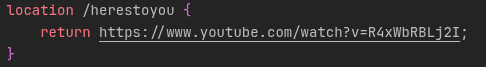

# Relatorio da aula 2

03/09/2026 - lab 03

Para nos introduzir o mundo do docker o professor nos pediu para execultar o comando `docker run hello-world`, apos executamos a gente teve que execultar o `docker --help` e `docker run --help` para compreender como usar a CLI do docker.

com essa introdução feita, nos tivemos que escolher um Servidor Web de nossa escolha, eu escolhir o nginx, pois ja conhecia de outros cantos, mais nunca mexi nele diretamente.

chegeui a montar um container com o docker-composer para o nginx
```yml
    nginx:
        image: nginx:latest # imagen mais recente do nginx
        ports:
        - "8080:80"   # o acesso a rede do conteiner, (tipo uma linkagem de rede)
                      # (porta da minha maquina):(porta dentro do container))
        volumes:
        - ./nginx:/etc/nginx # diretorio conectado do com o container do nginx
```

depois, foi pedido-nos para ler a documentação do Servidor que escolhemos, para montar um Proxy Reverso.

---

07/09/2026 - casa

apos longas 4 horas no vscode quebrando bastante a cabeça tentando entender o porque o nginx não estava mostrando o [index.html](./src/index.html) na porta 8080, decobrir que meu erro tava em tentar passar o link externo com o  `proxy_pass` no server do [default.conf.template](./nginx/templates/default.conf.template) e isso acabava por quebrar o server de alguma maneira, mais apois pequisar, perguntar a AIs e ver videos no youtube, descobrir que o jeito certo é por um `return` em seguida do link.


adicionei uma rota api que leva diretamente para uma musica no youtube



contudo feito, o resultado foi um pequeno serviço com um html bem basico e uma rota api que redireciona o para um video.